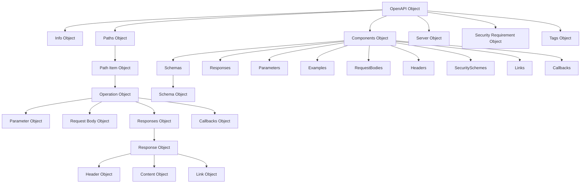

# OpenAPI 仕様 バージョン 3.0.0 の要約

## 概要

OpenAPI 仕様（OAS）3.0.0は、RESTful APIのための標準化された言語に依存しないインターフェイス定義です。この仕様を使用することで、ソースコード、ドキュメント、ネットワークトラフィック検査なしでサービスの機能を人間とコンピュータの両方が発見し理解できるようになります。

## 主要コンポーネント

### 基本構造

- OpenAPIドキュメントはJSONまたはYAML形式で記述できるJSONオブジェクト
- 必須フィールド: `openapi`（バージョン番号）、`info`（APIのメタデータ）、`paths`（利用可能なパスと操作）

### 主要オブジェクトとその関連性



1. **OpenAPI Object** - ルートオブジェクト

   - `openapi`: 仕様のバージョン番号（3.0.x）
   - `info`: APIのメタデータ
   - `servers`: ターゲットサーバーの接続情報
   - `paths`: APIで利用可能なパスと操作
   - `components`: 再利用可能なスキーマや定義
   - `security`: API全体に適用されるセキュリティメカニズム
   - `tags`: ドキュメントで使用されるタグのリスト

2. **Info Object** - APIに関するメタデータ

   - `title`: APIのタイトル
   - `version`: OpenAPIドキュメントのバージョン
   - `description`: APIの説明
   - `contact`: 連絡先情報
   - `license`: ライセンス情報

3. **Paths Object** - 利用可能なパスと操作を定義

   - 各パスはリソースへの相対パスで、`/`で始まる
   - パターンプロパティ: `^/`: [Path Item Object]
   - HTTP操作（GET、POST、PUT、DELETEなど）を定義

4. **Path Item Object** - 単一パスで利用可能な操作を記述

   - HTTP操作メソッド（get, post, put, delete, options, head, patch, trace）
   - `parameters`: パス全体に適用されるパラメータ
   - パスレベルでのサーバー定義が可能

5. **Operation Object** - APIエンドポイントの単一操作を記述

   - `responses`: 操作の応答
   - `parameters`: 操作固有のパラメータ
   - `requestBody`: リクエストの本文
   - `security`: 操作固有のセキュリティ要件

6. **Components Object** - 再利用可能なオブジェクトを保持
   - `schemas`: 再利用可能なスキーマ定義
   - `responses`: 再利用可能なレスポンス
   - `parameters`: 再利用可能なパラメータ
   - `securitySchemes`: セキュリティ定義
   - その他の再利用可能なコンポーネント
   - 各コンポーネントは異なる場所で `$ref` を使用して参照できる

### 重要スキーマの詳細説明

#### Schema Object

Schema Objectは、OpenAPI仕様の中で最も複雑で重要なオブジェクトの一つです。JSON Schema Draft 4に基づいており、以下の特徴があります：

- **データ型**:
  - `type`: string, number, integer, boolean, array, object
  - 単一の型のみサポート（3.0では複数の型を指定できない）
  - `nullable`: nullを許可するためのプロパティ
- **制約とバリデーション**:
  - 文字列: `minLength`, `maxLength`, `pattern`
  - 数値: `minimum`, `maximum`, `multipleOf`
  - 配列: `minItems`, `maxItems`, `uniqueItems`
  - オブジェクト: `required`, `properties`, `additionalProperties`
- **スキーマ合成**:
  - `allOf`: すべてのスキーマに一致する必要がある
  - `oneOf`: 正確に1つのスキーマに一致する必要がある
  - `anyOf`: 少なくとも1つのスキーマに一致する必要がある
  - `not`: 指定されたスキーマに一致してはならない
- **OpenAPI固有の拡張**:
  - `discriminator`: 多態性のサポート
  - `readOnly`/`writeOnly`: プロパティのアクセス制限
  - `example`: サンプルデータ

#### Security Scheme Object

APIのセキュリティメカニズムを定義するための重要なオブジェクト：

- **タイプ**:
  - `apiKey`: キーベースの認証（ヘッダー、クエリ、クッキー）
  - `http`: HTTP認証スキーム（Basic、Bearer、DigestなどのHTTP認証）
  - `oauth2`: OAuth2.0フロー（implicit, password, clientCredentials, authorizationCode）
  - `openIdConnect`: OpenID Connect検出を使用
- **フロー定義**: OAuth2.0認証フローの詳細設定が可能

## JSON Schemaとの関連性

OpenAPI 3.0.0は、JSON Schema Draft 4と部分的に互換性を持ちます：

1. **修正されたJSON Schemaサブセット**:

   - 3.0ではJSON Schema Draft 4の一部を修正したサブセットを使用
   - 完全互換ではなく、独自の拡張や制限がある

2. **主な制限**:

   - 複数の型を持つスキーマがサポートされていない
   - nullableな型は特別なプロパティ`nullable`でサポート
   - 一部のJSON Schema機能が除外されている

3. **OpenAPI固有の拡張**:
   - `example`/`examples`、`discriminator`、`readOnly`/`writeOnly` などはOpenAPI固有の拡張

## 実装例

### OpenAPI Document の基本構造例

```yaml
openapi: 3.0.0
info:
  title: サンプルAPI
  version: 1.0.0
  description: サンプルAPIの説明
paths:
  /users:
    get:
      summary: ユーザー一覧を取得
      responses:
        "200":
          description: 成功
          content:
            application/json:
              schema:
                type: array
                items:
                  $ref: "#/components/schemas/User"
components:
  schemas:
    User:
      type: object
      properties:
        id:
          type: integer
        name:
          type: string
```

### Schema Object の使用例

```yaml
components:
  schemas:
    User:
      type: object
      required:
        - id
        - email
      properties:
        id:
          type: integer
          format: int64
        email:
          type: string
          format: email
        name:
          type: string
          nullable: true
        status:
          type: string
          enum: [active, inactive, suspended]
        createdAt:
          type: string
          format: date-time
          readOnly: true
```

### コールバックの使用例

```yaml
paths:
  /subscribe:
    post:
      summary: 非同期イベントの購読
      requestBody:
        required: true
        content:
          application/json:
            schema:
              type: object
              properties:
                callbackUrl:
                  type: string
                  format: uri
      callbacks:
        myCallback:
          "{$request.body#/callbackUrl}":
            post:
              requestBody:
                content:
                  application/json:
                    schema:
                      type: object
                      properties:
                        eventType:
                          type: string
                        eventData:
                          type: object
              responses:
                "200":
                  description: コールバック処理成功
```

## 3.0.0の主な特徴

- Swagger 2.0からの主要な進化
- コンポーネントによる再利用可能なオブジェクトの整理
- リクエスト本文の改善された記述
- コールバックのサポート
- リンクオブジェクトによるAPIナビゲーション
- サーバー変数によるフレキシブルなサーバー設定
