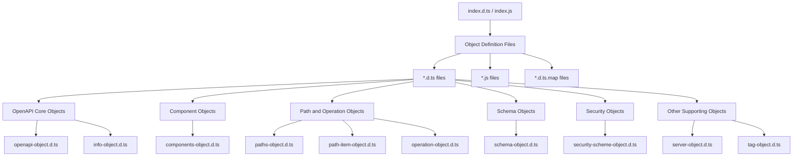
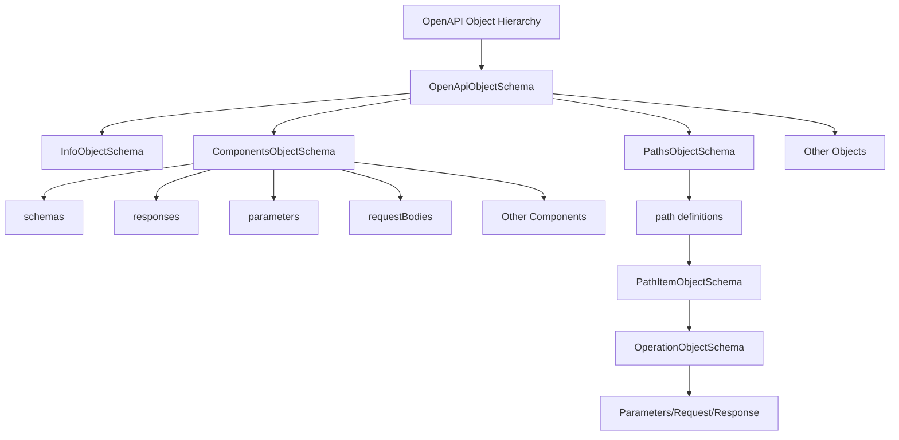
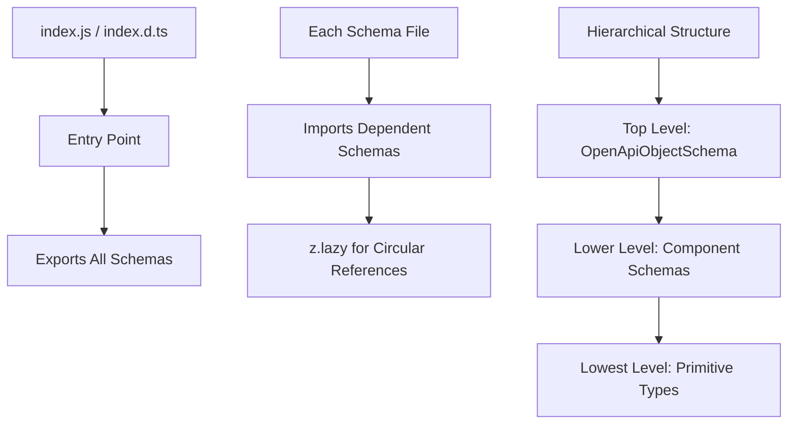

# @scalar/openapi-types/dist/schemas/3.1/processed Analysis

## 1. Directory Structure and File Composition

The directory contains the following types of files:



Files follow these naming patterns:

- `xxx-object.d.ts`: TypeScript type definitions
- `xxx-object.js`: Implementation files
- `xxx-object.d.ts.map`: Source map files

## 2. Definition of Main Schema Objects

All schema objects are defined using the [Zod](https://github.com/colinhacks/zod) library.



Example of schema object definition (OpenApiObjectSchema):

```typescript
// Type definition
type OpenApiObject = {
  openapi: string;
  info: z.infer<typeof InfoObjectSchema>;
  jsonSchemaDialect?: string;
  servers?: z.infer<typeof ServerObjectSchema>[];
  paths?: z.infer<typeof PathsObjectSchema>;
  // ...other properties
};

// Zod schema
const OpenApiObjectSchema = z
  .object({
    openapi: z.string().regex(/^3\.1\.\d+$/),
    info: InfoObjectSchema,
    // ...other property definitions
  })
  .passthrough();
```

Key features of SchemaObjectSchema (JSON Schema + OpenAPI extensions):

- JSON Schema standard fields (type, format, properties, items, etc.)
- OpenAPI-specific extensions (example, readOnly, writeOnly, etc.)
- Recursive type definitions (using z.lazy())
- Composition (allOf, oneOf, anyOf)

## 3. Import Structure and Module Division



Key points about module division:

1. Each object is defined in a dedicated file (following the single responsibility principle)
2. Interdependent objects are imported as needed
3. All objects are exported from index.js, allowing package users to access them through this entry point
4. Circular references are resolved using `z.lazy(() => SomeSchema)`
5. Complex objects (e.g., path-item-object) are divided into multiple files as needed (e.g., path-item-object-without-callbacks.js)

Example of key imports:

```typescript
// OpenAPI object
import { z } from "zod";
import { ComponentsObjectSchema } from "./components-object.js";
import { InfoObjectSchema } from "./info-object.js";
// ...other imports

// Components object
import { z } from "zod";
import { SchemaObjectSchema } from "./schema-object.js";
import { ResponseObjectSchema } from "./response-object.js";
// ...other imports
```

This structure allows for clear separation of each component in the OpenAPI 3.1 specification and enables type-safe schema validation.
