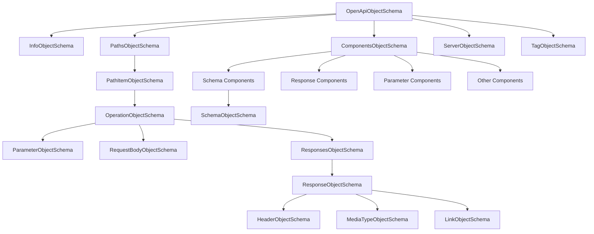

# OpenAPI v3.1.0 仕様とコード構造の関連付け

## 1. 各スキーマオブジェクトと OpenAPI v3.1.0 仕様の対応関係

### 1.1 主要オブジェクトの対応

| Zodスキーマ名                | OpenAPI v3.1.0 仕様の対応部分       | 説明                                                                             |
| ---------------------------- | ----------------------------------- | -------------------------------------------------------------------------------- |
| `OpenApiObjectSchema`        | OpenAPI Object (ルートオブジェクト) | API定義全体を表すルートオブジェクト。`openapi`、`info`などの必須フィールドを持つ |
| `InfoObjectSchema`           | Info Object                         | APIのメタデータ（タイトル、説明、バージョンなど）を含む                          |
| `PathsObjectSchema`          | Paths Object                        | APIで利用可能なパスと操作を定義するオブジェクト                                  |
| `PathItemObjectSchema`       | Path Item Object                    | 単一パスで利用可能な操作（GET、POST等）を記述                                    |
| `OperationObjectSchema`      | Operation Object                    | APIエンドポイントの単一操作（GETメソッドなど）を詳細に記述                       |
| `ComponentsObjectSchema`     | Components Object                   | 再利用可能なオブジェクト（スキーマ、レスポンス等）を保持                         |
| `SchemaObjectSchema`         | Schema Object                       | JSONデータ構造を定義する最も複雑なオブジェクト                                   |
| `ServerObjectSchema`         | Server Object                       | APIサーバーの接続情報を提供                                                      |
| `SecuritySchemeObjectSchema` | Security Scheme Object              | APIのセキュリティメカニズムを定義                                                |

### 1.2 ネスト/依存関係の詳細マッピング



## 2. Zodスキーマでの表現方法

### 2.1 基本的な表現パターン

1. **オブジェクト定義**:

   ```typescript
   const SomeObjectSchema = z
     .object({
       // プロパティ定義
       propertyName: z.string(),
       optionalProperty: z.number().optional(),
     })
     .passthrough(); // 未定義のプロパティを許容
   ```

2. **列挙型の表現**:

   ```typescript
   const methodEnum = z.enum([
     "get",
     "put",
     "post",
     "delete",
     "options",
     "head",
     "patch",
     "trace",
   ]);
   ```

3. **共用型（Union Types）**:

   ```typescript
   const typeUnion = z.union([z.string(), z.array(z.string())]);
   ```

4. **再帰的スキーマ定義**:
   ```typescript
   // 循環参照を解決するためのz.lazy()の使用
   const SchemaObjectSchema = z.lazy(() => {
     return z.object({
       // プロパティ定義
       properties: z
         .record(
           z.string(),
           z.lazy(() => SchemaObjectSchema),
         )
         .optional(),
     });
   });
   ```

### 2.2 複雑な制約条件の実装

1. **Schema Object での JSON Schema 機能のサポート**:

   ```typescript
   const SchemaObjectSchema = z.lazy(() => {
     return z
       .object({
         // 型定義
         type: z
           .union([
             z.enum([
               "string",
               "number",
               "integer",
               "boolean",
               "array",
               "object",
               "null",
             ]),
             z.array(
               z.enum([
                 "string",
                 "number",
                 "integer",
                 "boolean",
                 "array",
                 "object",
                 "null",
               ]),
             ),
           ])
           .optional(),

         // 数値制約
         minimum: z.number().optional(),
         maximum: z.number().optional(),

         // 文字列制約
         minLength: z.number().int().nonnegative().optional(),
         maxLength: z.number().int().nonnegative().optional(),
         pattern: z.string().optional(),

         // スキーマ合成
         allOf: z.array(z.lazy(() => SchemaObjectSchema)).optional(),
         oneOf: z.array(z.lazy(() => SchemaObjectSchema)).optional(),
         anyOf: z.array(z.lazy(() => SchemaObjectSchema)).optional(),
         not: z.lazy(() => SchemaObjectSchema).optional(),
       })
       .passthrough();
   });
   ```

2. **参照解決の仕組み（$ref サポート）**:

   ```typescript
   // リファレンスの直接サポート
   const ReferenceObjectSchema = z.object({
     $ref: z.string(),
   });

   // オブジェクトまたはリファレンスのいずれかを許可
   const ObjectOrReferenceSchema = z.union([
     SomeObjectSchema,
     ReferenceObjectSchema,
   ]);
   ```

3. **パターンプロパティのサポート**:

   ```typescript
   // PathsObjectSchemaでのパスパターン実装例
   const PathsObjectSchema = z
     .record(
       // キーがパスパターンに一致する必要がある
       z.string().regex(/^\//),
       // 値はPathItemObjectか$refのいずれか
       z.union([PathItemObjectSchema, ReferenceObjectSchema]),
     )
     .optional();
   ```

4. **Discriminator による多態性サポート**:

   ```typescript
   const DiscriminatorObjectSchema = z.object({
     propertyName: z.string(),
     mapping: z.record(z.string(), z.string()).optional(),
   });

   // Schema Object での使用例
   const SchemaObjectSchema = z.lazy(() => {
     return z
       .object({
         // ...他のプロパティ
         discriminator: DiscriminatorObjectSchema.optional(),
       })
       .passthrough();
   });
   ```

## 3. バリデーションロジックの詳細と特殊ケース処理

### 3.1 バージョン制約の検証

```typescript
// OpenAPI バージョン文字列の検証
const OpenApiObjectSchema = z
  .object({
    openapi: z.string().regex(/^3\.1\.\d+$/),
    // ...他のプロパティ
  })
  .passthrough();
```

### 3.2 循環参照の解決

```typescript
// z.lazy() による循環参照の解決
const SchemaObjectSchema = z.lazy(() => {
  return z
    .object({
      // ...プロパティ定義
      properties: z
        .record(
          z.string(),
          z.lazy(() => SchemaObjectSchema),
        )
        .optional(),
      items: z
        .union([
          z.lazy(() => SchemaObjectSchema),
          z.array(z.lazy(() => SchemaObjectSchema)),
        ])
        .optional(),
    })
    .passthrough();
});
```

### 3.3 特殊なバリデーションルール

1. **非負整数の検証**:

   ```typescript
   minLength: z.number().int().nonnegative().optional(),
   ```

2. **パスパラメータの必須制約**:

   ```typescript
   const ParameterObjectSchema = z.object({
     name: z.string(),
     in: z.enum(["query", "header", "path", "cookie"]),
     required: z
       .boolean()
       .optional()
       .superRefine((required, ctx) => {
         // パスパラメータの場合は常にrequired=trueが必要
         if (ctx.parent.in === "path" && required !== true) {
           ctx.addIssue({
             code: z.ZodIssueCode.custom,
             message: "Path parameters must have required set to true",
           });
         }
       }),
     // ...他のプロパティ
   });
   ```

3. **相互依存フィールド検証**:
   ```typescript
   const SecuritySchemeObjectSchema = z
     .object({
       type: z.enum(["apiKey", "http", "oauth2", "openIdConnect"]),
       // ...共通プロパティ
     })
     .superRefine((data, ctx) => {
       // type に応じた必須フィールド検証
       if (data.type === "apiKey") {
         if (!data.name) {
           ctx.addIssue({
             code: z.ZodIssueCode.custom,
             message: "name is required for apiKey security scheme",
             path: ["name"],
           });
         }
         if (!data.in) {
           ctx.addIssue({
             code: z.ZodIssueCode.custom,
             message: "in is required for apiKey security scheme",
             path: ["in"],
           });
         }
       } else if (data.type === "http") {
         if (!data.scheme) {
           ctx.addIssue({
             code: z.ZodIssueCode.custom,
             message: "scheme is required for http security scheme",
             path: ["scheme"],
           });
         }
       }
       // 他の条件も同様に検証
     });
   ```

### 3.4 passthroughによる拡張性サポート

ほぼすべてのスキーマオブジェクトで `.passthrough()` メソッドが使用されており、これによりOpenAPI仕様の拡張（Extensions）をサポートしています。拡張は `x-` で始まるカスタムプロパティです。

```typescript
const AnyObjectSchema = z
  .object({
    // 標準プロパティ
    standardProp: z.string(),
  })
  .passthrough(); // x-で始まる拡張プロパティなどを許可
```

### 3.5 互換性のための特殊処理

OpenAPI 3.1.0は、以前のバージョンとの互換性と、JSON Schema Draft 2020-12との完全な互換性を両立させるために、いくつかの特殊なケースを処理しています。

```typescript
// nullable プロパティの特殊処理（OpenAPI 3.0からの互換性）
const SchemaObjectSchema = z.lazy(() => {
  return z
    .object({
      // ...他のプロパティ
      nullable: z
        .boolean()
        .optional()
        .superRefine((nullable, ctx) => {
          // nullableとtype配列の両方が存在する場合の検証
          const type = ctx.parent.type;
          if (
            nullable === true &&
            Array.isArray(type) &&
            type.includes("null")
          ) {
            ctx.addIssue({
              code: z.ZodIssueCode.custom,
              message:
                "nullable: true should not be used when type includes null",
            });
          }
        }),
    })
    .passthrough();
});
```

## 4. まとめ

OpenAPI v3.1.0の仕様実装では、以下の主要なポイントが考慮されています：

1. **階層構造の忠実な実装**: OpenAPI v3.1.0の仕様に定義された階層構造が、Zodスキーマの構造と命名に直接反映されています。

2. **再帰と循環参照の適切な処理**: `z.lazy()` を活用して、Schema ObjectやPath Item Objectなどの再帰的な構造を効果的に実装しています。

3. **JSON Schema 2020-12との互換性**: OpenAPI v3.1.0の大きな特徴であるJSON Schemaとの完全な互換性をサポートするために、SchemaObjectSchemaに多数のJSON Schema機能が実装されています。

4. **バリデーション機能の充実**: 単純な型チェックだけでなく、`superRefine`などの高度なバリデーションメソッドを使用して、仕様の制約条件を厳密に検証しています。

5. **拡張性のサポート**: すべてのオブジェクトで`.passthrough()`を使用することで、OpenAPI拡張（x-プレフィックスを持つカスタムフィールド）をサポートしています。

この実装アプローチにより、OpenAPI v3.1.0の仕様に完全に準拠しながら、型安全なスキーマ検証が可能になっています。
