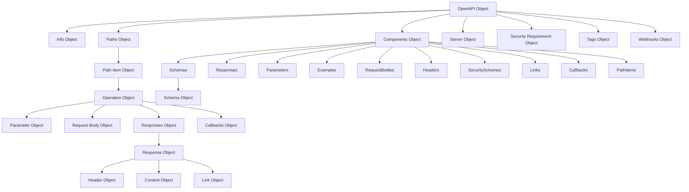

# OpenAPI 仕様 バージョン 3.1.0 の要約

## 概要

OpenAPI 仕様（OAS）3.1.0は、HTTP APIのための標準化された言語に依存しないインターフェイス定義です。この仕様を使用することで、ソースコード、ドキュメント、ネットワークトラフィック検査なしでサービスの機能を人間とコンピュータの両方が発見し理解できるようになります。

## 主要コンポーネント

### 基本構造

- OpenAPIドキュメントはJSONまたはYAML形式で記述できるJSONオブジェクト
- 少なくとも`paths`、`components`、または`webhooks`フィールドのいずれかが必要
- 必須フィールド: `openapi`（バージョン番号）と`info`（APIのメタデータ）

### 主要オブジェクトとその関連性



1. **OpenAPI Object** - ルートオブジェクト

   - `openapi`: 仕様のバージョン番号（3.1.x）
   - `info`: APIのメタデータ
   - `servers`: ターゲットサーバーの接続情報
   - `paths`: APIで利用可能なパスと操作
   - `webhooks`: 受信可能なウェブフック
   - `components`: 再利用可能なスキーマや定義
   - `security`: API全体に適用されるセキュリティメカニズム
   - `tags`: ドキュメントで使用されるタグのリスト

2. **Info Object** - APIに関するメタデータ

   - `title`: APIのタイトル
   - `version`: OpenAPIドキュメントのバージョン
   - `description`: APIの説明
   - `contact`: 連絡先情報
   - `license`: ライセンス情報

3. **Paths Object** - 利用可能なパスと操作を定義

   - 各パスはリソースへの相対パスで、`/`で始まる
   - パターンプロパティ: `^/`: [Path Item Object]
   - HTTP操作（GET、POST、PUT、DELETEなど）を定義

4. **Path Item Object** - 単一パスで利用可能な操作を記述

   - HTTP操作メソッド（get, post, put, delete, options, head, patch, trace）
   - `parameters`: パス全体に適用されるパラメータ
   - パスレベルでのサーバー定義が可能

5. **Operation Object** - APIエンドポイントの単一操作を記述

   - `responses`: 操作の応答
   - `parameters`: 操作固有のパラメータ
   - `requestBody`: リクエストの本文
   - `security`: 操作固有のセキュリティ要件

6. **Components Object** - 再利用可能なオブジェクトを保持
   - `schemas`: 再利用可能なスキーマ定義
   - `responses`: 再利用可能なレスポンス
   - `parameters`: 再利用可能なパラメータ
   - `securitySchemes`: セキュリティ定義
   - その他の再利用可能なコンポーネント
   - 各コンポーネントは異なる場所で `$ref` を使用して参照できる

### 重要スキーマの詳細説明

#### Schema Object

Schema Objectは、OpenAPI仕様の中で最も複雑で重要なオブジェクトの一つです。JSON Schema Specification Draft 2020-12に基づいており、以下の特徴があります：

- **JSON Schemaとの互換性**: OpenAPI 3.1.0では完全なJSON Schema Draft 2020-12をサポート
- **データ型**:
  - `type`: string, number, integer, boolean, array, object
  - 複数の型を配列で指定可能: `"type": ["string", "null"]`
- **制約とバリデーション**:
  - 文字列: `minLength`, `maxLength`, `pattern`
  - 数値: `minimum`, `maximum`, `multipleOf`
  - 配列: `minItems`, `maxItems`, `uniqueItems`
  - オブジェクト: `required`, `properties`, `additionalProperties`
- **スキーマ合成**:
  - `allOf`: すべてのスキーマに一致する必要がある
  - `oneOf`: 正確に1つのスキーマに一致する必要がある
  - `anyOf`: 少なくとも1つのスキーマに一致する必要がある
  - `not`: 指定されたスキーマに一致してはならない
- **OpenAPI固有の拡張**:
  - `discriminator`: 多態性のサポート
  - `readOnly`/`writeOnly`: プロパティのアクセス制限
  - `example`: サンプルデータ

#### Security Scheme Object

APIのセキュリティメカニズムを定義するための重要なオブジェクト：

- **タイプ**:
  - `apiKey`: キーベースの認証（ヘッダー、クエリ、クッキー）
  - `http`: HTTP認証スキーム（Basic、Bearer、DigestなどのHTTP認証）
  - `oauth2`: OAuth2.0フロー（implicit, password, clientCredentials, authorizationCode）
  - `openIdConnect`: OpenID Connect検出を使用
- **フロー定義**: OAuth2.0認証フローの詳細設定が可能

## JSON Schemaとの関連性

OpenAPI 3.1.0は、JSON Schema Draft 2020-12と完全に互換性を持つよう設計されています：

1. **完全なJSON Schemaサポート**:

   - 3.0までは独自の制限付きサブセットを使用
   - 3.1.0ではJSON Schemaの全機能をサポート

2. **$schema キーワード**:

   - `jsonSchemaDialect` プロパティで使用するJSON Schemaのバージョンを指定可能
   - デフォルトは `https://spec.openapis.org/oas/3.1/dialect/2024-11-10`

3. **主な違い**:

   - OpenAPIはJSONスキーマを拡張し、APIに特化した機能を追加
   - `example`/`examples`、`discriminator`、`readOnly`/`writeOnly` などはOpenAPI固有の拡張

4. **ダイナミックリファレンス**:
   - `$dynamicRef`と`$dynamicAnchor`の導入によるより柔軟な参照メカニズムのサポート

## 実装例

### OpenAPI Document の基本構造例

```yaml
openapi: 3.1.0
info:
  title: サンプルAPI
  version: 1.0.0
  description: サンプルAPIの説明
paths:
  /users:
    get:
      summary: ユーザー一覧を取得
      responses:
        "200":
          description: 成功
          content:
            application/json:
              schema:
                type: array
                items:
                  $ref: "#/components/schemas/User"
components:
  schemas:
    User:
      type: object
      properties:
        id:
          type: integer
        name:
          type: string
```

### Schema Object の実装例（Zodでの実装）

```typescript
// Zodを使用したSchemaObjectの実装例
const SchemaObjectSchema = z.lazy(() => {
  return z
    .object({
      // JSONSchema標準プロパティ
      type: z
        .union([
          z.enum([
            "string",
            "number",
            "integer",
            "boolean",
            "array",
            "object",
            "null",
          ]),
          z.array(
            z.enum([
              "string",
              "number",
              "integer",
              "boolean",
              "array",
              "object",
              "null",
            ]),
          ),
        ])
        .optional(),
      format: z.string().optional(),
      properties: z
        .record(
          z.string(),
          z.lazy(() => SchemaObjectSchema),
        )
        .optional(),
      items: z
        .union([
          z.lazy(() => SchemaObjectSchema),
          z.array(z.lazy(() => SchemaObjectSchema)),
        ])
        .optional(),
      required: z.array(z.string()).optional(),

      // 数値制約
      minimum: z.number().optional(),
      maximum: z.number().optional(),

      // 文字列制約
      minLength: z.number().int().nonnegative().optional(),
      maxLength: z.number().int().nonnegative().optional(),
      pattern: z.string().optional(),

      // 配列制約
      minItems: z.number().int().nonnegative().optional(),
      maxItems: z.number().int().nonnegative().optional(),
      uniqueItems: z.boolean().optional(),

      // スキーマ組成
      allOf: z.array(z.lazy(() => SchemaObjectSchema)).optional(),
      oneOf: z.array(z.lazy(() => SchemaObjectSchema)).optional(),
      anyOf: z.array(z.lazy(() => SchemaObjectSchema)).optional(),
      not: z.lazy(() => SchemaObjectSchema).optional(),

      // OpenAPI固有の拡張
      discriminator: DiscriminatorObjectSchema.optional(),
      readOnly: z.boolean().optional(),
      writeOnly: z.boolean().optional(),
      example: z.any().optional(),
    })
    .passthrough();
});
```

### Pathsとコンポーネントの関連性

```yaml
paths:
  /pets/{petId}:
    get:
      parameters:
        - $ref: "#/components/parameters/petId"
      responses:
        "200":
          $ref: "#/components/responses/Pet"
        "404":
          $ref: "#/components/responses/NotFound"

components:
  parameters:
    petId:
      name: petId
      in: path
      required: true
      schema:
        type: integer

  responses:
    Pet:
      description: ペット情報
      content:
        application/json:
          schema:
            $ref: "#/components/schemas/Pet"

    NotFound:
      description: リソースが見つかりません

  schemas:
    Pet:
      type: object
      required:
        - id
        - name
      properties:
        id:
          type: integer
        name:
          type: string
```

## 主な改良点（3.0からの変更点）

- JSON Schema Draft 2020-12への完全対応
- Webhooksのネイティブサポート
- より柔軟なスキーマ定義（複数のデータ型、nullability）
- パスアイテムのコンポーネント化
- セキュリティスキームの強化
- 新しいリンクオブジェクトの導入
